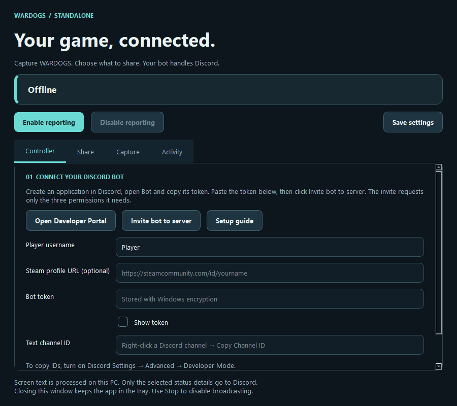

# WARDOGS Discord

A Windows companion that keeps your squad up to date through **one live Discord message**.
Install it, connect a Discord bot, choose what to share, and click **Start broadcasting**.
No Python installation, terminal commands, configuration files, or separate OCR setup needed.

## Install

Download **WARDOGS-Discord-Setup.exe** from [Releases](https://github.com/scopeddlol/WARDOGS-Discord-Integration/releases), then run it.
The installer includes Python, the desktop app, Tesseract, and English OCR data. It installs
for your Windows account without administrator privileges and adds a Start menu shortcut.
Windows 10 (1809+) or Windows 11, x64, is required.

During development, installers are also available in the **standalone-installer** artifact on
successful [Windows build runs](https://github.com/scopeddlol/WARDOGS-Discord-Integration/actions/workflows/build.yml).
Download and unzip the artifact to get the setup EXE. GitHub requires sign-in for artifact downloads.
Builds are currently unsigned; Windows may show an unknown-publisher warning.

## Connect once, then play

1. Open **Discord** and follow the Developer Portal link to create a Discord bot.
2. Invite it to your server with **View Channel**, **Send Messages**, and **Embed Links**.
3. Paste its token and your text channel ID into the app. Enter your display name.
4. Click **Check connection**, then choose what to share in **Share**.
5. Click **Enable reporting** and launch WARDOGS. Briefly open the pause menu after joining
   a server so the app can read its details.

See the [step-by-step setup instructions](docs/SETUP.md) for Discord setup, capture calibration,
privacy, troubleshooting, and removing your saved settings.

## What you control

- Server name / region and optional server ID
- Queue position
- Faction / team and live team scores
- Not-in-game status
- WARDOGS window selection, scan frequency, and score update frequency
- Optional Steam profile link on your username, launch at Windows sign-in, and automatic broadcasting
- A capture-border preference and a button to open Windows screenshot-border permission

Stop broadcasting at any time from the window or system tray. **Stop keeps the last Discord
message as it was**; no further updates are sent after the current request finishes.
Closing the window keeps the app in the tray; choose **Quit** there to exit completely.
Settings are editable while stopped, preventing half-applied changes during a broadcast.

## How detection works

The original project's screen-reading engine detects pause-menu server details, queue text,
faction colors, and HUD scores. It does not read game memory or require a game plugin.
The desktop app captures only the WARDOGS process window, even behind other apps.
The regular gameplay HUD identifies a match; server details are added whenever the pause menu is seen.
Minimizing the game holds the last confirmed reading until capture resumes or WARDOGS closes.
Capture previews are explicit, local-only tests. No screenshots are uploaded or saved by normal operation.

The bot uses Discord's REST API to edit one message, with debounce, score throttling, and
rate-limit handling. No privileged gateway intents or broad Manage Server permissions are required.
Independent installations can use the same channel; each keeps its own message ID.

## Development and packaging

See [BUILDING.md](docs/BUILDING.md). The Windows workflow runs tests, builds the app and installer,
installs it into an isolated directory, tests the installed GUI and bundled OCR, checks an upgrade,
and uninstalls it. It uploads the installer, SHA-256 checksum, and smoke-test evidence.
Tags matching `v*` additionally create a **draft** GitHub release for maintainer review.

The original command-line tools remain available to contributors:
`python wardogs_status_bot.py --dry-run`, `--once`, and `python region_preview.py`.
Those legacy tools use `.env` and an external Tesseract installation; the desktop app uses its own
per-user settings and bundled runtime. Do not run both against the same bot/channel simultaneously.

## License

Project code: [MIT](LICENSE). Bundled dependencies retain their own licenses; see
[third-party notices](docs/THIRD_PARTY.md) and the installed `_internal/licenses` folder.
Unofficial community project; not affiliated with the makers of WARDOGS or Discord.
